# Coral Reef AI

**Coral Reef AI** is a comprehensive data analysis tool designed to streamline data exploration, analysis, and visualisation in order to understand the ecosystem of Coral Reefs globally. The tool supports multiple data formats and provides an intuitive interface for both novice and expert data scientists.

 

## Dataset Content
* Dhe dataset is named "Corals Worldwide Distribution", from [Kaggle]( https://www.kaggle.com/datasets/natalialimanska/corals-worldwide-distribution/data?select=corals_worldwide_test_set.csv). It consists of 10 columns and 2451 rows, it is 205 kB in size.

The ten columns consist of:
  1. name: sea name
  2. salinity: practical salinity units (PSU) of sea water surface
  3. January_temp: temperature of sea water surface in Celsius degrees
  4. June_temp: temperature of sea water surface in Celsius degrees
  5. area: area of sea in square km
  6. latitude: coordinates rounded
  7. longitude: coordinates rounded
  8. types of sea: 1 - enclosed landlocked, 2 - partly enclosed, 3 - marginal, 4 - no land boundaries
  9. corals: 0 - absence of corals, 1 - presence of corals (Target variable)
  10. silt/sulfide: 1 - presence of silt/sulfide, 0 - absence of silt/sulfide

## Business Requirements
* Our mission is to analyse, monitor and protect the Coral Reef Ecosystems globally. Data was sourced from various literature resources and the Marine Copernicus Satellite missions. Protecting underwater plant life affects many biodiverse species and is protected under the International law of Wildlife Protection Act of 2010, formed under UN Environmental Programme [UNEP](https://www.unep.org/explore-topics/oceans-seas/what-we-do/protecting-coral-reefs). Let us provide you with the data intelligence to help you conserve and identify the location of Coral Reefs.

* Our Business Requirements are as follows:

    1. Identify the Presence of Coral Reefs

        - Determine where Coral Reefs are present and the where coral reef ecosystems occur.

    2. Monitor Environmental Impacts

        - Identify how environmental variables (e.g., salinity, temperature, silt and sulfide) are impacting coral health and diversity.

    3. Support Conservation Policies

        - Provide data to inform and justify conservation efforts, protected areas, or intervention strategies.

    4. Predict At-Risk Areas

        - Use predictive modeling to forecast which coral reef areas are most at risk under future environmental scenarios.

    5. Comply with Reporting Standards
        - Align reporting with international biodiversity and environmental frameworks (e.g., SDG 14: Life Below Water, CBD targets).

    6. Engage Stakeholders
        - Generate actionable insights for marine biologists, NGOs, government agencies, and local communities through a built-in interactive Dashboard.

## Hypothesis and how to validate?
* List here your project hypothesis(es) and how you envision validating it (them) 

1. Identify the Presence of Coral Reefs

    - Determine where Coral Reefs are present and the where coral reef ecosystems occur.
        - Various visualisations were used to identify the presence of coral reefs. The correlation matrix was used to understand which features were highly correlated, such as Salinity, Silt or Sulfide(inverse relationship), January Temperature and Latitude, Type of Sea was depended on Longitude. 

    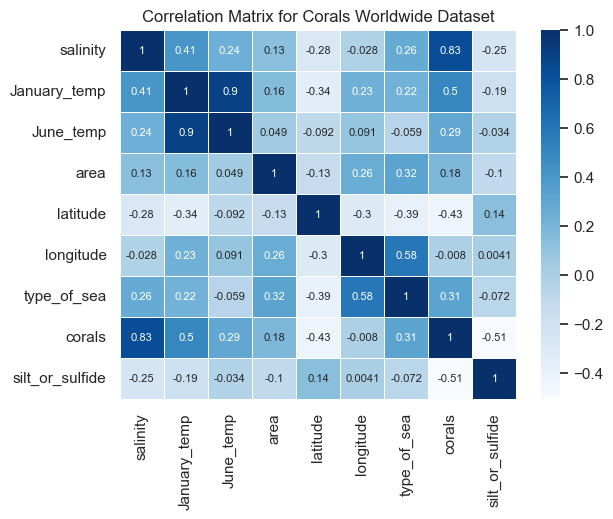 

    - Further investigations were done in scatter and bar plots with Salinity vs Corals, in order to test at what value of Salinity was needed for Corals to exist. I found that no corals existed below the value of 24.5. There was also an overlap between 24 and 32 where both corals were present and absent. This is when other natural factors came into place for example temperature, presence of Silt or Sulfide had an inverse effect and latitude or longitude. Salinity was definity the highest feature that determined if Coral Reefs were present or absent.

     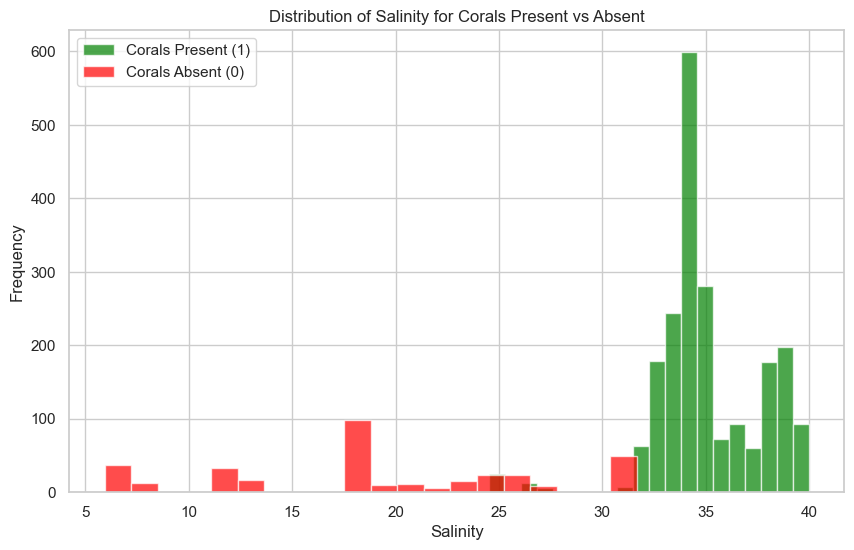   

    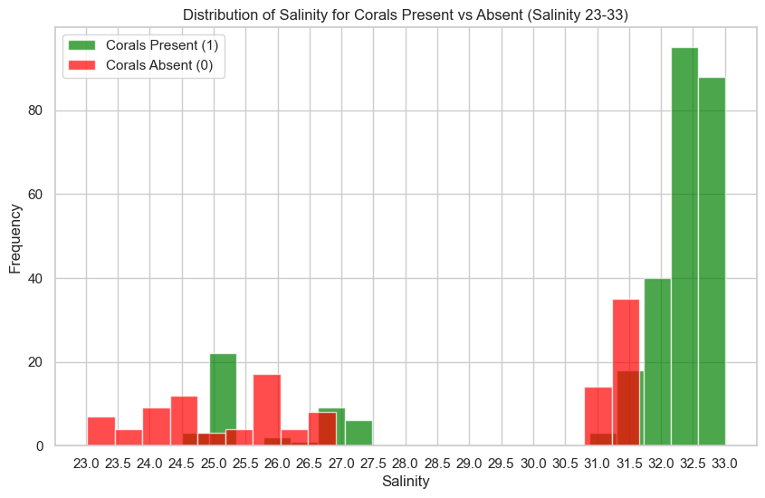 

    

    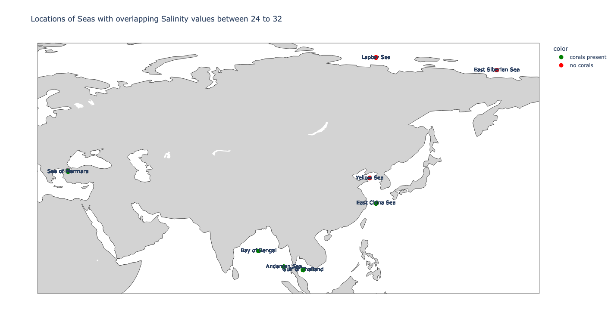  

            - For a better view and zooming in properties, please refer to the (HTML_maps folder) to view the plot on "Locations of Seas with overlapping Salinity values between 24 to 32".

    2. Monitor Environmental Impacts

        - Identify how environmental variables (e.g., salinity, temperature, silt and sulfide) are impacting coral health and diversity.
            - Environmental variables played an important role too, however on a much medium or lower priority. The presence of Silt and Sulfide had a medium negative impact on the presence of Coral Reefs. The effect of Latitude and Longitude had a lower priority impact on the Coral Reefs, as some were also found around the Artic and Antarctica. As long the presence of Salinity and Silt or Sulfide were in balance, Corals could be found. 
            

    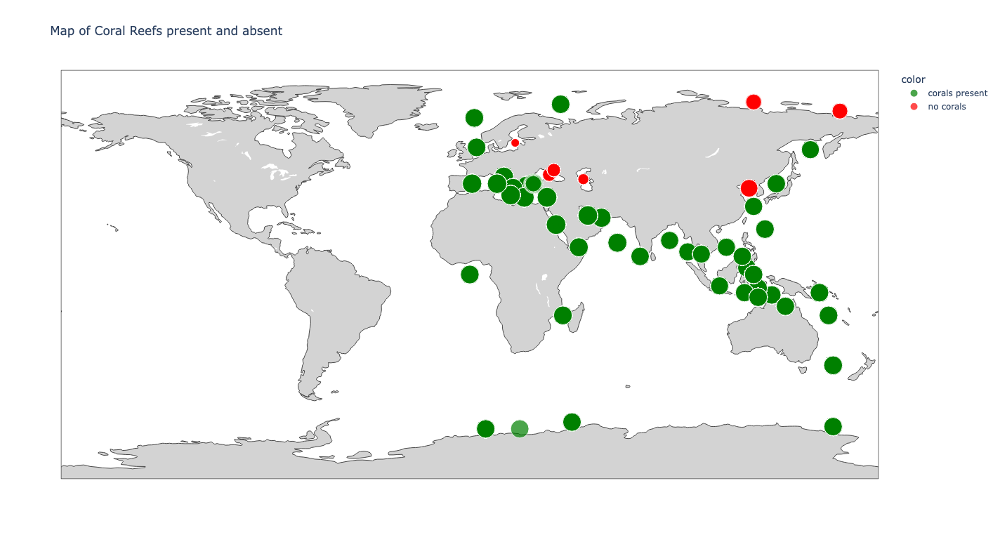 

    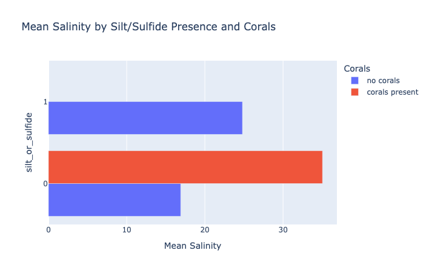 

    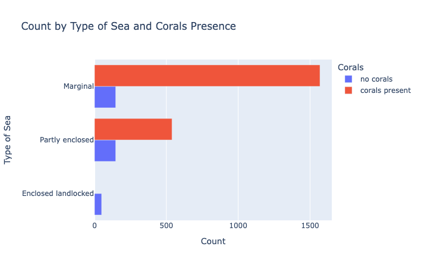

    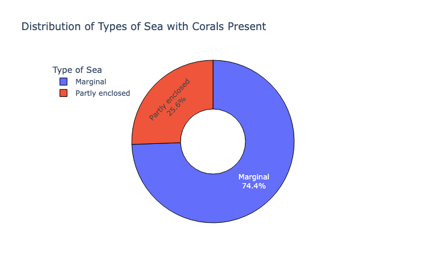

    3. Support Conservation Policies

        - Provide data to inform and justify conservation efforts, protected areas, or intervention strategies.
            - A Dashboard was created in Power BI that allows none technical audience the ability to make informed decisions about where Coral Reefs are located and what environmental influences affect Coral Reefs.
            - A discussion about Conservation Policies are also found under the ethics section.
            

    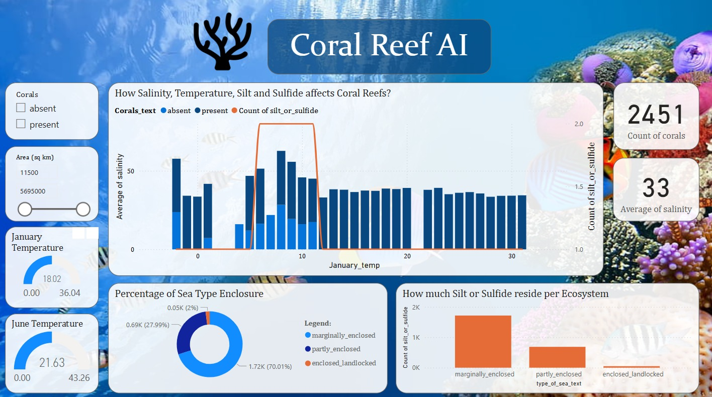

    4. Predict At-Risk Areas

        - Use predictive modeling to forecast which coral reef areas are most at risk under future environmental scenarios.
            - A Machine Learning model, was also used to train data in order to predict if Coral Reefs are present or not. The accuracy proved to be at 1.00(100%) for both test and training data using the Random Forest Classifier. Which is very good. Grid Search CV was used to compare the best model and Random Forest Classifier proved to be the best.
            - The best correlated features were also Salinity and January Temperature.

    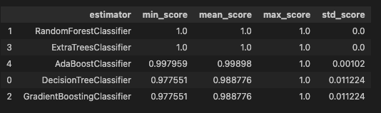

    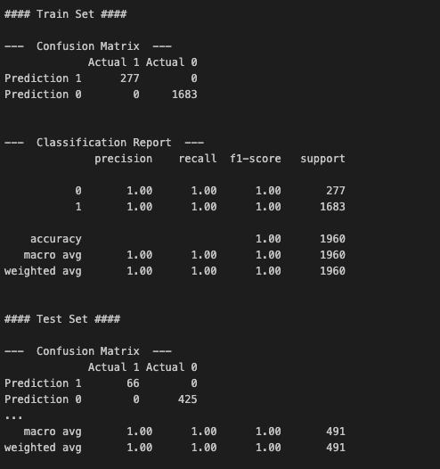

    - In the Dashboard, the third page on Predictive Analysis, uses a Decomposition Tree to break down the likelihood of Coral Reefs being present or not.

    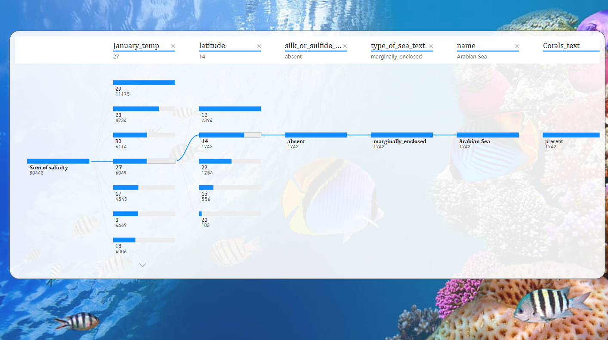
            

    5. Comply with Reporting Standards
        - Align reporting with GDPR data protection standards and international biodiversity and environmental frameworks (e.g., SDG 14: Life Below Water, CBD targets).
            - All align with the reporting standards as it obeys the GDPR data protection standards where no personal data was shared. 
            - A discussion is provided under Ethics as to the SDG 14: Life Below Water standards, which were also followed, as the data was collected in a non threatening way, for example, satellite data, which still adheres to the protection of biodiversity species such as Coral Reefs.

    6. Engage Stakeholders
        - Generate actionable insights for marine biologists, NGOs, government agencies, and local communities through a built-in interactive Dashboard.
            - A Dashboard was created in Power BI, which has a Descriptive Statistics analysis, Geographical Analysis and Predictive Analysis page for Stakeholders to interactive with and make decisions.
            - Unfortunately, due to limitations of Power BI not having the premium version an interactive map could not be produced. This map is a mere approximation of where the Corals are located as I overlaid a georectified image behind the scatterplot of latitude and longitude. However if you zoom in, the points do not move with the image. It is only used as an overview.

    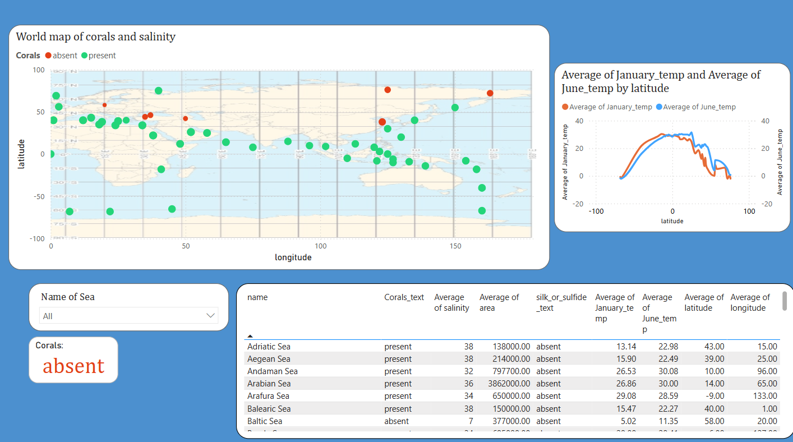

## Project Plan
* Outline the high-level steps taken for the analysis.
    - ETL & EDA analysis with input raw dataset
    - Advanced visualisations and Statistical analysis for a technical audience
    - Machine Learning Predictions
    - Power BI Dashboard creation for non-technical audience
    - README documentation summarising the investigation 

* How was the data managed throughout the collection, processing, analysis and interpretation steps?
    - Data was managed in a file system called Dataset/raw and Dataset/cleaned as saved as a .csv file.
    - HTML maps were also supplied and stored in this folder
    - Jupyter notebooks folder stored the necessary notebook files for ETL, Visualisations and Machine Learning code.
    - Static images folder was used for storing the screenshots within the README file.
    - A separate file for the Dashboard called Coral_Reef_AI.pbix was added for Power BI viewing.

* Why did you choose the research methodologies you used?
    - I chose the research methodologies as it gave me the best results to produce a project on this scale. It is well structured and provided the best results.

## The rationale to map the business requirements to the Data Visualisations
* List your business requirements and a rationale to map them to the Data Visualisations
    - To understand the relationship between Salinity and Coral Reef present, I used scatter plots and bar charts to understand where most of the Coral Reefs are present. 
    - A further investigation was to look at the area of overlap between Coral Reefs being present and absent. This with the help of a geographic map, pointed to the presence of Silt and Sulfide that influenced if Coral Reefs were present. The presence of Silt and Sulfide, has a medium priority importance value on if Coral Reefs are present or not. However Salinity has the highest priority, without it, it does not survive.
    - I also used Plotly to produce geographical maps of the location of Coral Reefs, together with other information (when you over over the map, more feature informations appear). This can be found in under /Dataset/HTML_maps. 
    - Geographical maps together with temperature data also pointed to a medium to low priority importance value between January and June temperatures. With high temperatures, the Coral Reefs thrived, however Coral Reefs can also exist at lower temperatures as seen on the geographical maps at the Artic and Antartica. As long as the presence of Salinity and balance of Silt and Sulfide exists.
    - Pie charts and Bar charts were used to represent the Type of Sea were the ecosystem exists, showing that Marginal and Partially enclosed environments were where most Coral Reefs were located. There was no data on no land boundary environments and enclosed landlocked did not point to Coral Reefs being present. There were not a lot of data on those last Type of Sea descriptions.
    - The Bar Chart on the size of the area vs Corals present, did not influence as much as seen on the correlation matrix. If Corals were present, then the size of the area was big. This could be due to their growing nature, if the conditions are good and balanced. 

## Analysis techniques used
* List the data analysis methods used and explain limitations or alternative approaches.
    - Power BI limitation: I could not plot a geographic map. I overcame it by plotting a scatterplot of the Latitude and Longitude and using the other features in the Tooltip to view the other information. I overlaid a rectified image behind the scatterplot as an image, it allows the user to have a better understanding of the location of the point, however when you zoom in, the position shifts, so it cannot be used as the exact position.
    - Plotly geographical map: Unfortunately, my dataset from Kaggel only gave me data of the middle and eastern countries with Coral Reefs and excluded North and South America. The North and South American data points were used as testing in the Kaggel users account, so I could not use that. I plotted the data only of the middle and eastern countries.

* How did you structure the data analysis techniques. Justify your response.
    - I structured my analysis for a technical and non-technical audience. The technical audience can use the Jupyter notebooks to make decisions and the non-technical audience can use the Power BI Dashboard to better their understanding.
* Did the data limit you, and did you use an alternative approach to meet these challenges?
    - No, I did not have data limitations.
* How did you use generative AI tools to help with ideation, design thinking and code optimisation?
    - I used ChatGPT4.0 and Copilot to assist me with coding problems and research.
    - ChatGPT helped me research Ethics, Biases and Legal considerations when investigating a Coral Reef dataset.
    - Copilot assisted me in commenting my code and optimising the code for better plotting.

## Ethical considerations
* Were there any data privacy, bias or fairness issues with the data?
* How did you overcome any legal or societal issues?

## Dashboard Design
* List all dashboard pages and their content, either blocks of information or widgets, like buttons, checkboxes, images, or any other item that your dashboard library supports.
* Later, during the project development, you may revisit your dashboard plan to update a given feature (for example, at the beginning of the project you were confident you would use a given plot to display an insight but subsequently you used another plot type).
* How were data insights communicated to technical and non-technical audiences?
* Explain how the dashboard was designed to communicate complex data insights to different audiences. 

## Unfixed Bugs
* Please mention unfixed bugs and why they were not fixed. This section should include shortcomings of the frameworks or technologies used. Although time can be a significant variable to consider, paucity of time and difficulty understanding implementation are not valid reasons to leave bugs unfixed.
* Did you recognise gaps in your knowledge, and how did you address them?
* If applicable, include evidence of feedback received (from peers or instructors) and how it improved your approach or understanding.

## Development Roadmap
* What challenges did you face, and what strategies were used to overcome these challenges?
* What new skills or tools do you plan to learn next based on your project experience? 

## Deployment
### Heroku

* The App live link is: https://YOUR_APP_NAME.herokuapp.com/ 
* Set the runtime.txt Python version to a [Heroku-20](https://devcenter.heroku.com/articles/python-support#supported-runtimes) stack currently supported version.
* The project was deployed to Heroku using the following steps.

1. Log in to Heroku and create an App
2. From the Deploy tab, select GitHub as the deployment method.
3. Select your repository name and click Search. Once it is found, click Connect.
4. Select the branch you want to deploy, then click Deploy Branch.
5. The deployment process should happen smoothly if all deployment files are fully functional. Click now the button Open App on the top of the page to access your App.
6. If the slug size is too large then add large files not required for the app to the .slugignore file.

## Main Data Analysis Libraries
* Here you should list the libraries you used in the project and provide an example(s) of how you used these libraries.

## Credits 

* In this section, you need to reference where you got your content, media and extra help from. It is common practice to use code from other repositories and tutorials, however, it is important to be very specific about these sources to avoid plagiarism. 
* You can break the credits section up into Content and Media, depending on what you have included in your project. 

* Sources

Data Sources on Kaggel taken from these resources:
- https://www.ranker.com/list/coral-reef-pictures/robert-desalvo
- https://www.waisworkshop.org/sites/waisworkshop.org/files/files/ASEP-final.pdf
- http://www.sargassoseacommission.org/storage/documents/SargassoBrochure.FIN.pdf
- https://sciendo.com/article/10.1515/ohs-2016-0023
- https://www.researchgate.net/publication/239520916_Mudie_et_al_2002_poll/link/0c96051c07e341afff000000/download
- https://climate.esa.int/en/projects/sea-surface-salinity/data/
- https://climate.esa.int/en/odp/#/project/sea-surface-temperature
- https://en.wikipedia.org/wiki/List_of_seas
- https://link.springer.com/article/10.1007/s00343-020-0035-4
- https://seatemperature.info/philippines-water-temperature.html
- https://www.seatemperature.org/middle-east/yemen/aden.htm
- https://www.solananin.hr/en/nature/the-adriatic-sea/#:~:text=The%20salinity%20of%20the%20Adriatic,in%20one%20kilogram%20of%20water.
- https://www.waterdatabase.com/seas/aegean-sea/
- https://www.harteresearch.org/sites/default/files/inline-files/3.pdf
- https://www.researchgate.net/publication/290056034_Salinity_distribution_in_the_Arabian_Sea
- https://agupubs.onlinelibrary.wiley.com/doi/pdf/10.1029/2005GL022972
- https://www.frontiersin.org/articles/10.3389/fmars.2020.00573/full
- https://agupubs.onlinelibrary.wiley.com/doi/full/10.1002/2015JC011197
- https://www.sciencedirect.com/science/article/abs/pii/S0278434304001955
- https://agupubs.onlinelibrary.wiley.com/doi/10.1029/2005JC003093
- https://www.frontiersin.org/articles/10.3389/fmars.2020.568602/full
- https://www.geomar.de/en/news/article/from-the-baltic-sea-to-the-south-sea
- https://data-gis.unep-wcmc.org/portal/apps/mapviewer/index.html     (layers=fb9b160602e84a139ffc4fc16cf74bfc)
- https://kids.frontiersin.org/articles/10.3389/frym.2019.00038
- https://www.ncbi.nlm.nih.gov/pmc/articles/PMC8945884/
- https://seos-project.eu/coralreefs/coralreefs-c01-p03.html
- https://www.uts.edu.au/news/social-justice-sustainability/salinity-seawater-ruining-coral-chemistry
- https://oceanservice.noaa.gov/facts/coralwaters.html
- https://www.nature.com/scitable/knowledge/library/coral-reefs-15786954/
- https://www.researchgate.net/figure/Temperature-and-salinity-in-Maluku-Sea-to-Banda-Sea_tbl1_338874679
- https://www.seatemperature.org/asia/indonesia/amahai-january.htm
- https://en.banglapedia.org/index.php/Bay_of_Bengal#:~:text=Salinity%20the%20surface%20salinity%20in,from%2010%25%20to%2025%25.
- https://www.researchgate.net/publication/29492893_Analysis_of_salinity_measurements_near_islands_on_the_French_continental_shelf_of_the_Bay_of_Biscay
- https://www.mdpi.com/2072-4292/14/3/758
- https://laulima.hawaii.edu/access/content/group/dbd544e4-dcdd-4631-b8ad-3304985e1be2/book/chapter_1/longitude.htm
- https://www.frontiersin.org/articles/10.3389/fmars.2021.672210/full
- https://agupubs.onlinelibrary.wiley.com/doi/full/10.1002/2017JC012983
- https://hal.science/hal-01463320/document
- https://data.marine.copernicus.eu/product/MULTIOBS_GLO_PHY_S_SURFACE_MYNRT_015_013/description
- https://data.marine.copernicus.eu/product/SST_GLO_PHY_L4_NRT_010_043/download
- https://data.marine.copernicus.eu/viewer/expert? (view=dataset&dataset=MULTIOBS_GLO_PHY_SSS_L4_MY_015_015)
- https://data.marine.copernicus.eu/product/SST_GLO_PHY_L4_NRT_010_043/download
- https://nopr.niscpr.res.in/handle/123456789/499
- https://seatemperature.net/seas/tasman-sea#:~:text=Tasman%20Sea%3A%20water%20temperature%20data&text=The%20warmest%20water%20in%20Tasman,its%20value%2057%C2%B0F.
- https://www.nature.com/articles/s41598-020-65266-9/
- http://users.auth.gr/elvoults/pdf/Octocorals%2094
- http://ikee.lib.auth.gr/record/207895?ln=en
- https://media.greenpeace.org/archive/Coral-Reef-in-Andaman-Sea-27MZIFJJD5RXO.html
- https://link.springer.com/referenceworkentry/10.1007/978-90-481-2639-2_123
- https://parksaustralia.gov.au/marine/management/resources/scientific-publications/biological-survey-arafura-sea/
- https://www.majorcadailybulletin.com/holiday/life-style/2021/07/02/86273/deep-sea-gems-the-balearic-sea.html
- https://www.oceanicsociety.org/expedition/banda-sea-reefs-blue-whales-and-hammerhead-sharks/
- https://www.tandfonline.com/doi/abs/10.1080/17451000.2017.1331040?journalCode=smar20
- https://www.cambridge.org/core/services/aop-cambridge-core/content/view/74331738D1AF52E340B14C314B6E571E/S0376892900024218a.pdf/tourism_and_corals_in_the_bay_of_bengal_islands.pdf
- https://www.whoi.edu/oceanus/feature/creatures-of-the-celebes-sea/
- https://ocean52.com/corals-from-the-deep-and-cold-waters-around-antarctica
- https://www.grida.no/resources/7163
- https://www.researchgate.net/publication/369954367_Benthic_biodiversity_by_baited_camera_observations_on_the_Cosmonaut_Sea_shelf_of_East_Antarctica/link/6436ab64ad9b6d17dc52f34e/download
- https://www.mdpi.com/2673-1924/4/1/5
- https://www.alamy.com/coral-reef-in-komodo-national-park-flores-sea-nusa-tenggara-indonesia-komodo-islands-is-also-a-part-of-the-coral-triangle-which-contains-one-of-image228501895.html https://gcrmn.net/red-sea-and-gulf-of-aden-region/
- https://www.environment.gov.au/sprat-public/action/kef/view/84
- https://www.sciencedirect.com/science/article/pii/S2352485522003371
- https://www.frontiersin.org/articles/10.3389/fmars.2020.00130/full
- https://www.sciencedirect.com/science/article/abs/pii/S0967064513002798
- https://www.academia.edu/70000720/The_compromised_health_of_coral_at_South_Java_Sea_Study_area_Prigi_Bay
- https://www.researchgate.net/publication/266512906_Coral_reefs_of_Lakshadweep_-_a_glimpse
- https://www.issuelab.org/resources/18612/18612.pdf https://oceanservice.noaa.gov/
- https://www.academia.edu/13604409/Reproduction_patterns_of_four_Antarctic_octocorals_in_the_Weddell_Sea_an_inter_specific_shape_and_latitudinal_comparison
- https://www.researchgate.net/publication/225389028_Structure_and_biodiversity_of_megabenthos_in_the_Weddell_and_Lazarev_Seas_Antarctica_Ecological_role_of_physical_parameters_and_biological_interactions
- https://www.centrescientifique.mc/uploads/documents/fr_27.pdf https://education.nationalgeographic.org/resource/worlds-seas/
- https://www.scirp.org/journal/paperinformation.aspx?paperid=65708
- https://www.oceano.org/en/ocean-in-question/is-there-coral-in-the-mediterranean/
- https://www.academia.edu/32675982/Diversity_of_Stoloniferan_Coral_Stolonifera_at_Lirang_Island_Southwest_Maluku_Moluccas_Indonesia
- https://bcssmz.org/the-mozambique-channel-2/
- https://www.wildlifetrusts.org/wildlife-explorer/marine/anemones-and-corals/cold-water-coral
- https://sciencenorway.no/biodiversity-coral-reefs-ecosystem/as-many-as-200000-coral-reefs-off-norway/1613170
- https://www.sciencedirect.com/science/article/pii/S0025326X15301612#f0005
- https://www.researchgate.net/publication/258375695_Check-list-of-corals-species-of-the-Persian-Gulf-Iranian-waters_tbl1_258375695
- https://www.nationalgeographic.com/magazine/article/philippines-reefs-are-some-of-the-most-vibrant-but-in-peril-feature
- https://www.env.go.jp/nature/biodic/coralreefs/reference/contents/0102.pdf
- https://www.researchgate.net/publication/289124296_Scleractinian_diversity_in_the_Dardanelles_and_Marmara_Sea_Turkey_morphology_ecology_and_distributional_patterns_Oceanological_and_Hydrobiological_Studies_45_2_259-285
- https://iupress.istanbul.edu.tr/tr/book/mucilage-problem-in-the-sea-of-marmara/chapter/the-impact-of-mucilage-on-soft-corals-and-gorgonians-in-the-sea-of-marmara
- https://www.academia.edu/84297354/New_species_of_deep_sea_Heteropolypus_soft_corals_Anthozoa_Octocorallia_from_the_Kurile_Islands_Sea_of_Okhotsk_Northwest_Pacific_with_summary_data_on_distinctive_characters_of_the_known_species_of_the_genus
- https://www.jstor.org/stable/2416859
- https://www.biotaxa.org/Zootaxa/article/view/zootaxa.5169.1.3
- https://www.sciencedirect.com/science/article/abs/pii/S0031018222001274
- https://www.nationalgeographic.com/photography/article/tubbataha-coral-reef-philippines-unesco-world-heritage-site-sulu-sea
- https://www.conservation.org/places/sulu-sulawesi-seascape
- https://theconversation.com/exploring-australias-other-reefs-south-of-tasmania-108986
- https://theconversation.com/exploring-australias-other-reefs-south-of-tasmania-10898
- https://www.abc.net.au/news/2022-05-08/east-timor-coral-reefs-tourism-climate-change-bleaching/101015018
- https://journals.plos.org/plosone/article?id=10.1371/journal.pone.0049870
- https://www.researchgate.net/publication/289124296_Scleractinian_diversity_in_the_Dardanelles_and_Marmara_Sea_Turkey_morphology_ecology_and_distributional_patterns_Oceanological_and_Hydrobiological_Studies_45_2_259-285/link/63e63cd9c002331f726b5c1e/download
- https://arctic.noaa.gov/Report-Card/Report-Card-2021/ArtMID/8022/ArticleID/944/Sea-Surface-Temperature
- https://www.researchgate.net/figure/a-Ross-Sea-water-mass-temperature-and-salinity-characteristics-for-depths-shallower_fig6_265165800
- https://link.springer.com/article/10.1007/BF02255384#:~:text=The%20salinity%20ranges%20from%20about,mille%20in%20the%20Bornholm%20Sea.
- https://www.frontiersin.org/articles/10.3389/fmars.2017.00118/full
- https://www.oceansnorth.org/wp-content/uploads/2018/07/en-03-canadas-arctic-marine-atlas-chapter-three-bottom-of-food-web.pdf
- https://www.researchgate.net/publication/232749461_Identification_of_Mega-_and_Macrobenthic_Ecologically_and_Biologically_Significant_Areas_EBSAs_in_the_Hudson_Bay_Complex_the_Western_and_Eastern_Canadian_Arctic/link/0912f5093fae80a9bc000000/download
- https://www.researchgate.net/publication/250219252_Cold-water_coral_growth_in_relation_to_the_hydrography_of_the_Celtic_and_Nordic_European_continental_margin
- https://www.fisheries.noaa.gov/science-blog/innovation-learn-more-about-alaskas-deep-sea-corals-and-species-live-there-post-8
- https://www.researchgate.net/publication/236122576_Corals_and_Coral-reef_Communities_in_the_Gulf_of_California
- https://www.dfo-mpo.gc.ca/oceans/oecm-amcepz/refuges/gsl-central-centre-eng.html
- https://www.researchgate.net/publication/299450775_The_protection_and_management_of_the_Sargasso_Sea_The_golden_floating_rainforest_of_the_Atlantic_Ocean_Summary_Science_and_Supporting_Evidence_Case
- https://www.sciencedirect.com/science/article/pii/S0079661121001592
- https://oceanexplorer.noaa.gov/facts/explored.html

### Content 

- The text for the Home page was taken from Wikipedia Article A
- Instructions on how to implement form validation on the Sign-Up page was taken from [Specific YouTube Tutorial](https://www.youtube.com/)
- The icons in the footer were taken from [Font Awesome](https://fontawesome.com/)

### Media

- The photos used on the home and sign-up page are from This Open-Source site
- The images used for the gallery page were taken from this other open-source site

## Acknowledgements (optional)
* Thank the people who provided support through this project.